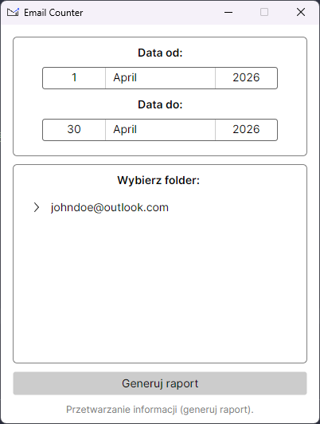
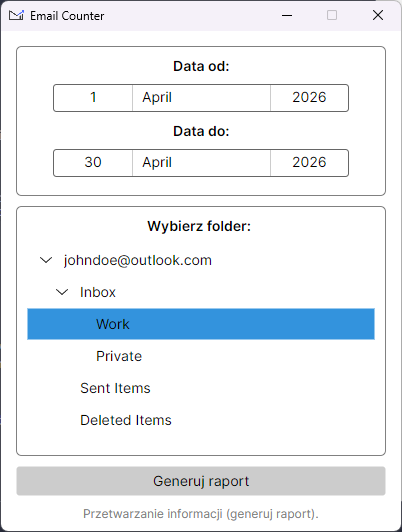
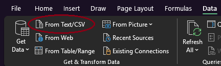
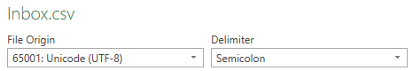

# 📧 Email Counter App
A desktop application for real-time email tracking.
## 📖 Overview
The **Email Counter App** is a lightweight utility designed to help users monitor the number of emails in desired folder. It also allows generating .csv reports which include the most important details of the emails.
## ✨ Key Features
- **Real-time Monitoring:** Keep track of the number of emails in desired folder.
- **Reports:** Generate reports for further analysis.
## 🛠️ Tech Info
- **Framework:** Avalonia UI (Cross-platform XAML-based GUI)
- **Language:** C# / .NET
- **Architecture:** MVVM (Model-View-ViewModel)
- **Design Tools:** Figma
- **Designed for:** Windows 11
## 🚀 Getting Started
### Prerequisites
- .NET SDK 8.0
- Microsoft Outlook (classic)[^1]
### Installation
1. Clone the repository:
```sh
git clone https://github.com/hmikolajczyk/email-counter.git
```
2. Navigate to the project directory:
```sh
cd email-counter\src\EmailCounter.Gui
```
3. Build and run the application:
```sh
dotnet build
dotnet run
```
### Using the GUI
The app may take several seconds to open as it establishes a connection with Outlook services.

**1. Date Selection:** Upon startup, the app automatically sets the date range to the previous full month. You can adjust the Start Date *(Data od)* and End Date *(Data do)* manually.



**2. Folder selection:** Select the desired Outlook folder from the tree menu.



**3. Generating Report:** Click the "Generuj raport" button. A `.csv` file will be generated and saved directly to your Desktop.
>[!WARNING]
>**Opening the report in Excel**
>
>Avoid opening the .csv file by double-clicking it, as it may cause formatting and encoding issues (especially with Polish characters).
>To view the data correctly in Excel:
>1. Open a new Excel spreadsheet.
>2. Go to **`Data>From Text/CSV`**:
>
>
>
>3. In the import window, ensure you select the following settings:
>
>


## 🚧 Current Status
- [x] - Working GUI
- [x] - Working .csv exports
- [x] - Enhanced status bar notifications and error reporting
- [ ] - Handling edge cases
- [ ] - **Soon:** Stable v1.0.0 release with standalone binaries
## ⚖️ License
Distributed under the MIT License. This software is provided "as is", without warranty of any kind. See `MIT license` for more information.

---
[^1]: Microsoft Outlook (classic) is required for COM Interop connectivity
